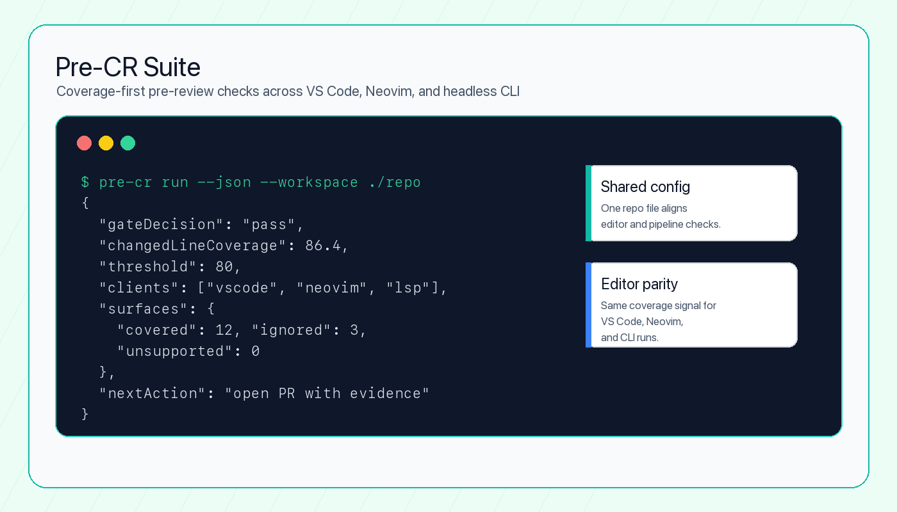

# Pre-CR Suite

Coverage-first pre-PR readiness for VS Code and Neovim.

Pre-CR Suite is moving to a public beta around one workflow:

1. Run `Pre-CR Check`
2. Refresh coverage overlays and summaries
3. Fix repo setup issues from a shared `.pre-cr.json`

The beta promise is simple: the same repo-configured coverage workflow should behave the same in VS Code and Neovim before you open a pull request.



## Why This Matters

### Problem

Coverage and setup problems usually surface too late: after a branch is pushed, after CI starts, or after review already began. Editor extensions, CLI scripts, and repo-specific coverage commands often drift from one another.

### Who It Helps

Pre-CR helps developers and reviewers who want a pre-review signal inside the tools they already use. It is especially useful for teams that care about changed-line coverage but do not want every editor, repo, and CI job to invent its own readiness workflow.

### What I Built

I built a TypeScript monorepo with shared coverage/config logic, a language server, a VS Code client, a Neovim client, and a headless CLI path. The core workflow runs a repo-defined Pre-CR check, refreshes coverage overlays, and reports setup issues from `.pre-cr.json`.

### Technical Decisions

- The shared `@pre-cr/core` package owns coverage parsing, repo config, changed-line evaluation, and protocol contracts.
- The LSP server keeps VS Code, Neovim, and generic clients on the same behavior instead of duplicating editor logic.
- `.pre-cr.json` is the repo-level contract so editor settings stay presentational and project behavior stays versioned.
- The CLI uses the same core pipeline as the editor integrations so automation and local editor feedback do not diverge.

### How To Run It

```bash
pnpm install
pnpm build
pnpm test
pnpm typecheck
pre-cr run --json --workspace /path/to/repo
```

Use `Pre-CR: Run Pre-CR Check` in VS Code or `:PreCrCheck` in Neovim for the editor workflow.

### What I Would Improve Next

The next improvements are clean-clone release verification, stronger marketplace packaging evidence, and a tighter demo path that shows the same failure moving through CLI JSON, VS Code diagnostics, and Neovim commands.

## Public Beta Scope

| Surface | Status | Notes |
| --- | --- | --- |
| Run Pre-CR Check | Supported | Runs tests with coverage and checks changed-line coverage against the repo threshold |
| Refresh Coverage | Supported | Reloads configured coverage reports for overlays, diagnostics, and summaries |
| Fix Setup | Supported | Shows repo config, coverage-path, and test-command health |
| VS Code | Supported | Ships with a bundled language-server artifact |
| Neovim | Supported | Uses the published `@pre-cr/server` package |
| Generic LSP clients | Compatible | Protocol-compatible, but not first-class beta targets |
| Checklist, docs, review, context, debug | Experimental | Still available in-repo, but not part of the beta contract |

## Quick Start

### VS Code

Install the extension, open a repo, and use:

- `Pre-CR: Run Pre-CR Check`
- `Pre-CR: Refresh Coverage`
- `Pre-CR: Fix Setup`

VS Code uses the bundled server artifact inside the extension package. No separate server install is required.

### Neovim

Install the server:

```bash
pnpm add -g @pre-cr/server
```

Then wire the plugin into your config and use:

- `:PreCrCheck`
- `:PreCrRefresh`
- `:PreCrSummary`
- `:PreCrFixSetup`

See [packages/neovim-client/README.md](packages/neovim-client/README.md) for the full setup.

## Repo Configuration

Project behavior lives in `.pre-cr.json` at the repo root.

```json
{
  "version": 1,
  "testCommand": "pnpm test -- --coverage",
  "coveragePaths": [
    "coverage/lcov.info",
    "coverage/coverage-final.json"
  ],
  "coverageFormat": "auto",
  "threshold": 80,
  "excludePatterns": [
    "**/*.test.*",
    "**/*.spec.*",
    "**/__tests__/**"
  ],
  "checks": {
    "coverage": true,
    "security": false,
    "checklist": false
  }
}
```

Notes:

- `.pre-cr.json` is the canonical source of repo behavior across editors.
- Legacy `coveragePath` is still accepted during beta and maps to the first `coveragePaths` entry.
- Editor settings are for presentation only: colors, notifications, and experimental visibility.

## Development

```bash
pnpm install
pnpm build
pnpm lint
pnpm test
pnpm typecheck
pnpm package
```

## Workspace Layout

```text
packages/
  core/           Shared coverage, config, protocol, and pre-check logic
  server/         LSP server for beta and experimental methods
  vscode-client/  VS Code extension with bundled server artifact
  neovim-client/  Neovim client commands and setup
```

## Docs

- [docs/CONFIGURATION.md](docs/CONFIGURATION.md)
- [docs/ROADMAP.md](docs/ROADMAP.md)
- [packages/vscode-client/README.md](packages/vscode-client/README.md)
- [packages/neovim-client/README.md](packages/neovim-client/README.md)

## License

MIT
